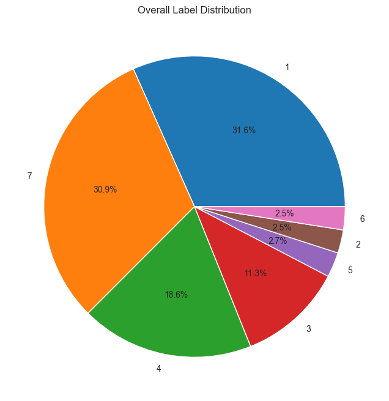

# Human-Action-Classification

This repository provides an end-to-end pipeline for classifying human actions. It covers data loading, preprocessing, windowing, feature extraction, model training (Random Forest baseline), evaluation, a command-line interface (CLI), and a minimal Flask web app for inference.

---

## Table of Contents

- [Project Structure](#project-structure)
- [Setup](#setup)
- [Data Format](#data-format)
- [Pipeline Overview](#pipeline-overview)
- [Training](#training)
- [Evaluation](#evaluation)
- [Inference (CLI)](#inference-cli)
- [Web App](#web-app)
- [Feature Extraction](#feature-extraction)
- [Sample Window Creation](#sample-window-creation)
- [Extending and Customizing](#extending-and-customizing)
- [Requirements](#requirements)
- [License](#license)

---

## Project Structure

```
action-classification/
│
├── data/                   # Raw accelerometer CSV files (per participant)
│   ├── 1.csv
│   ├── 2.csv
│   └── ... 
│
├── models/                 # Saved models
│   ├── random_forest_model.joblib
│   └── rf_baseline.joblib
│
├── notebooks/              # Jupyter notebooks for EDA and prototyping
│   └── eda.ipynb
│
├── reports/                # Generated plots and evaluation reports
│
├── src/                    # Source code
│   ├── cli_app.py          # CLI for inference
│   ├── evaluate.py         # Evaluation script
│   ├── features.py         # Feature extraction
│   ├── load_data.py        # Data loading utilities
│   ├── preprocess.py       # Preprocessing utilities
│   ├── segmentation.py     # Windowing/segmentation
│   ├── train.py            # Model training script
│   ├── web_app.py          # Flask web server for inference
│   └── ...
│
├── requirements.txt        # Python dependencies
├── README.md               # Project documentation
└── sample_window.csv       # Example input window for inference
```

---

## Setup

1. **Clone the repository:**
   ```
   git clone https://github.com/kamrandar/Human-Action-Classification.git
   ```

2. **Install dependencies:**
   ```
   pip install -r requirements.txt
   ```

3. **Prepare data:**
   - Place your accelerometer CSV files in the `data/` directory.
   - Each file should have columns: `seq,x,y,z,label` (no header by default).

---

## Data Format

Each CSV in `data/` should look like:
```
0,1502,2215,2153,1
1,1667,2072,2047,1
...
```
- `seq`: Sequence number (optional)
- `x, y, z`: Accelerometer readings
- `label`: Integer action label


**Label Map:**
```
1: Working at Computer
2: Standing Up/Walking/Going Stairs
3: Standing
4: Walking
5: Going Up/Down Stairs
6: Walking and Talking
7: Talking while Standing
```


---

## Pipeline Overview

1. **Data Loading:**  
   Loads and concatenates all CSVs in `data/`.

2. **Preprocessing:**  
   - Removes/caps outliers
   - Normalizes/scales features

3. **Segmentation:**  
   - Splits data into fixed-size windows (e.g., 104 rows ≈ 2 seconds)

4. **Feature Extraction:**  
   - Computes statistical features (mean, std, etc.) for each window

5. **Model Training:**  
   - Trains a Random Forest classifier (with class balancing and cross-validation)

6. **Evaluation:**  
   - Reports accuracy, F1-score, confusion matrix

7. **Inference:**  
   - CLI and web app for predicting action from new sample windows

---

## Training

Train the model using:

```
python src/train.py
```

- Model is saved as `models/rf_baseline.joblib` (or similar).

---

## Evaluation

Evaluate the trained model:

```
python src/evaluate.py
```

- Outputs classification report and confusion matrix.
- Plots are saved in `reports/`.

---

## Inference (CLI)

Predict the action for a new sample window (CSV with columns `x,y,z` and ~104 rows):

```
python src/cli_app.py --input_csv src/sample_window.csv
```

- Uses the trained model in `models/rf_baseline.joblib` by default.
- Prints the predicted label and its meaning.

---

## Web App

Start the Flask web server for interactive inference:

```
python src/web_app.py
```

- Visit `http://localhost:5000` in your browser.
- Use `test_post.py` to test the web app with a sample window.

---

## Feature Extraction

Features are extracted from each window using `src/features.py`.  
Typical features include:
- Mean, standard deviation, min, max for each axis and magnitude
- (See `extract_stat_features` in `features.py` for details)

---

## Sample Window Creation

To create a sample window from your data:

```python
import pandas as pd

# Load a CSV file (e.g., 1.csv)
df = pd.read_csv('data/1.csv', header=None, names=['seq', 'x', 'y', 'z', 'label'])

# Extract the first 104 rows as a sample window
sample_window = df.head(104)

# Save only the features (x, y, z) to sample_window.csv
sample_window[['x', 'y', 'z']].to_csv('sample_window.csv', index=False)
```

---

## Extending and Customizing

- **Try other classifiers:** Edit `train.py` to use SVM, XGBoost, etc.
- **Tune hyperparameters:** Use `GridSearchCV` in `train.py` or `eda.ipynb`.
- **Add new features:** Edit `features.py` to extract more features.
- **Window size:** Change window length in `segmentation.py` and update inference accordingly.

---

## Requirements

Freeze your environment with:
```
pip freeze > requirements.txt
```

Or install from the provided file:
```
pip install -r requirements.txt
```

---

## Contact

For questions or contributions, open an issue or pull request on GitHub.

---